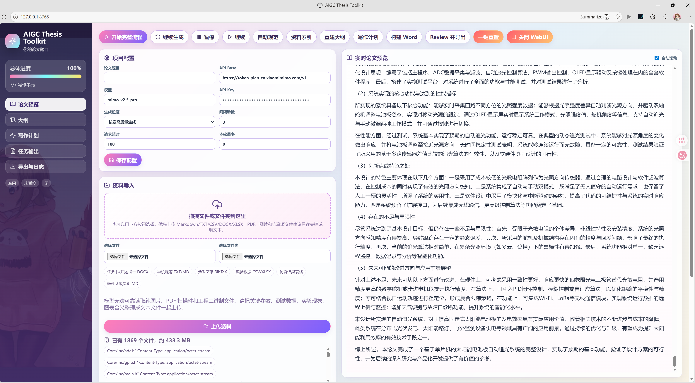

# AIGC Thesis Toolkit

AIGC Thesis Toolkit 是一个本地运行的 AI 论文写作工作流。

[](LICENSE)



它可以把你放入 `user_data/` 的参考资料、学校格式要求、开题/中期报告、参考论文、仿真或实验数据等内容，整理成可追踪的资料索引，并辅助生成论文大纲、章节正文、完整 Markdown 和 Word 文档。
这个项目的目标不是“一键交作业”，而是提供一个更稳定、更可控、更容易续写的 AIGC 论文工作台：你提供真实资料和格式要求，系统默认按章串行生成内容，并保留中间文件、状态和预览，方便你检查、修改和导出。

## 功能亮点

- **本地 WebUI 工作台**：在浏览器里配置 API、上传资料、编辑/导入写作规范、启动生成、暂停/继续、查看进度和实时预览正文。
- **支持 OpenAI 兼容接口**：只要服务兼容 Chat Completions 格式，就可以通过 `api_base`、`api_key`、`model` 接入。
- **自动资料索引**：扫描 `user_data/`，对可读资料逐文件/分块调用 AI 提取事实，再生成 `user_data/resources.md`。
- **自动写作规范**：可以从学校模板、任务书、开题报告、论文范例等资料中生成 `thesis/style.md`，也可以手动导入。
- **按章高质量生成**：默认把论文大纲拆成章节任务，一章生成完成后再进入下一章，用更高 token 消耗换取更好的上下文一致性。
- **可暂停、可续写**：生成进度记录在 `thesis/section_plan.json`，已经完成的章节默认不会重复生成。
- **稳定的导出格式**：公式编号会在导出前从公式体中拆出；插图默认保留位置、题注和说明，不直接插入图片。
- **导出 Word**：把生成的章节/小节合并成 `output/thesis.md`，再按 `template/reference.docx` 导出 `output/thesis.docx`。
- **适合上传 GitHub**：API Key、个人资料、生成正文、日志和输出文件默认不会提交。

## 工作流程

```text
user_data/ 个人资料
        -> AI 生成 user_data/resources.md
        -> AI 生成或导入 thesis/style.md
        -> AI 生成 thesis/outline.md
        -> 生成 thesis/section_plan.json
        -> 逐章生成 thesis/sections/
        -> 合并 output/thesis.md
        -> 导出 output/thesis.docx
```

## 快速开始

推荐在 WSL、Linux、macOS 或其他支持 `venv` 的 Python 环境中运行。新版 WebUI 需要 Node.js 18+ 和 npm 9+。

```bash
git clone https://github.com/Epiphany-Leave/aigc-thesis-toolkit.git
cd aigc-thesis-toolkit

python3 -m venv .venv
source .venv/bin/activate
python -m pip install --upgrade pip
python -m pip install -r requirements.txt

python workflow.py init
```

可选但推荐安装系统级资料抽取工具，能显著提升 `.doc`、PDF 和图片资料的读取率：

```bash
sudo apt update
sudo apt install -y poppler-utils antiword catdoc tesseract-ocr tesseract-ocr-chi-sim
```

其中 `poppler-utils` 提供 `pdftotext`，用于抽取可复制文本的 PDF；`antiword/catdoc` 用于读取老版 `.doc`；`tesseract` 用于图片 OCR。没有安装这些工具时，系统仍会尽量读取 DOCX/XLSX/TXT/CSV，并对 `.doc` 或部分工程文件做二进制字符串恢复，但效果会弱一些。

安装并构建 React WebUI：

```bash
cd workflows/webui/frontend
npm install
npm run build
cd ../../..
```

启动本地服务，一个终端即可：

```bash
python workflow.py ui
```

打开浏览器：

```text
http://127.0.0.1:8765
```

如果 `8765` 端口已被占用，程序会自动尝试后续端口，并在终端输出实际地址。

### 正式使用与开发模式

正式使用时只需要一个终端：

```bash
python workflow.py ui
```

这条命令会启动 Python 本地后端，并直接服务已经构建好的 React 页面。日常测试论文生成、上传资料、配置 API、预览正文时，不需要运行 `npm run dev`。

开发 WebUI 界面时才需要两个终端：

```bash
# 终端 1：启动 Python 后端
python workflow.py ui

# 终端 2：启动 Vite 前端开发服务
cd workflows/webui/frontend
npm run dev
```

然后打开：

```text
http://127.0.0.1:5173
```

两个终端的原因是：`npm run dev` 只负责前端热更新页面，不负责读写本地文件、调用 workflow、保存配置、上传资料或启动生成任务。这些能力仍然由 Python 后端提供。如果只运行 `npm run dev`，页面可以打开，但 API 请求没有后端响应，核心功能无法使用。

如果你不开发界面，只测试核心功能，请使用：

```bash
python workflow.py ui
```

## WebUI 使用方式

启动 WebUI 后，常规流程都可以在页面里完成。

### 1. 项目配置

在“项目配置”中填写：

- 论文题目
- API Base
- API Key
- 模型名称
- 生成粒度：默认“按章高质量生成”
- 写作单元间隔秒数
- 请求超时秒数
- 本轮最多写作单元数，`0` 表示不限制

点击“保存配置”后，私有配置会写入：

```text
configs/local.yaml
```

这个文件已经被 `.gitignore` 忽略，不会默认上传到 GitHub。

### 2. 资料导入

在“资料导入”中可以一次性导入：

- 零散文件
- 整个文件夹
- 多个文件和一个文件夹的组合

没有选择文件时点击上传不会写入任何内容，页面会提示先选择文件。上传完成后会提示导入数量，并展示 `user_data/` 中的文件总数、总体积和前若干个文件预览。

### 3. 写作规范

写作规范对应：

```text
thesis/style.md
```

你可以在 WebUI 中直接编辑保存，也可以上传 Markdown/TXT 文件导入。如果没有现成规范，可以把学校格式要求、任务书、论文模板等放入 `user_data/`，再点击“自动规范”，系统会扫描资料生成 `thesis/style.md`。

### 4. 生成流程

常用按钮含义：

- “开始完整流程”：依次初始化、生成大纲、生成计划、生成正文，全部完成后构建 Word。
- “继续生成”：只继续生成未完成正文。
- “暂停”：当前写作单元完成后，停在下一个写作单元之前。
- “继续”：取消暂停标记。
- “自动规范”：扫描资料并生成 `thesis/style.md`。
- “资料索引”：重新扫描 `user_data/`，生成 `user_data/resources.md`。
- “参考文献”：优先读取上传的 `.bib`，没有 BibTeX 时尝试通过 Crossref 自动检索，生成 `user_data/references.bib` 和 `thesis/references.md`。
- “重建大纲”：根据资料和规范重新生成 `thesis/outline.md`。
- “写作计划”：根据大纲生成 `thesis/section_plan.json`。
- “构建 Word”：把 Markdown 合并并导出 `output/thesis.docx`。
- “Review 并导出”：按章节串行审阅论文，章节过长会自动切块，输出 `output/review_results.md` 和 `thesis/logs/review_*.md`，完成后重新构建 `output/thesis.docx`。
- “一键重置”：清空 `user_data/`、已生成章节、输出文件、日志、大纲和计划，保留 API 配置，用于开始一篇新论文。
- “关闭 WebUI”：关闭本地 Python 服务。

右侧面板可以查看：

- 实时论文预览
- 论文大纲
- 写作计划
- 任务输出日志
- 导出与日志：下载 `output.zip`、`thesis.docx`、`thesis.md`、Review 报告，并查看 `thesis/logs` 最新日志

### 5. 推荐测试顺序

第一次完整测试建议按这个顺序：

1. 运行 `python workflow.py init`。
2. 构建前端：`cd workflows/webui/frontend && npm install && npm run build && cd ../../..`。
3. 运行 `python workflow.py ui`。
4. 在 WebUI 中保存 API 配置。
5. 导入资料文件或资料文件夹。
6. 点击“自动规范”或手动编辑 `style.md`。
7. 点击“资料索引”。这一步会对可读取资料逐文件/分块调用 AI 提取关键信息，再汇总成 `user_data/resources.md`。
8. 点击“参考文献”。如果你已经上传 `.bib` 会优先使用；否则会联网尝试检索。
9. 点击“重建大纲”。
10. 点击“写作计划”。
11. 点击“继续生成”或“开始完整流程”。
12. 生成完成后点击“构建 Word”。

如果你想测试全自动链路，可以在配置和资料准备好以后直接点击“开始完整流程”。

## 应该上传哪些资料

可以把资料放入 `user_data/`，也可以通过 WebUI 上传。

推荐上传：

- 任务书、开题报告、中期报告、学校格式规范
- 参考论文、BibTeX、文献笔记
- 仿真文件、实验数据、CSV/Excel 表格
- 原理图、流程图、实物照片、结果图片
- 学校提供的 Word 模板或往届论文范例

为了减少“瞎写”，建议把资料分成两类：

- **模型可直接读取的核心资料**：Markdown、TXT、CSV、BibTeX、LaTeX、JSON、YAML、DOCX、XLSX。系统会尽量抽取这些文件中的文本或表格片段，并逐文件/分块调用 AI 提取事实，写入 `user_data/resources.md`。
- **可通过工具增强读取的资料**：老版 `.doc`、可复制文本的 PDF、包含清晰文字的图片。推荐安装 `antiword/catdoc`、`poppler-utils` 和 `tesseract-ocr` 后再运行“资料索引”。
- **模型只能作为文件名线索的资料**：PDF 扫描件、纯图片原理图、仿真工程文件、压缩包、二进制文件。系统会尝试 OCR 或字符串恢复，但不能保证完整理解其中内容。

如果关键资料在 PDF、图片或仿真软件里，建议额外整理一个文本说明文件，例如：

```text
user_data/project_facts.md
user_data/test_data.csv
user_data/figure_notes.md
user_data/hardware_parameters.md
```

这些文件里最好写清楚：

- 课题名称、研究对象、系统组成
- 使用的单片机、传感器、电机、驱动、电源模块等真实型号
- 关键电路参数、采样周期、控制算法、阈值、PID 参数
- 真实测试数据、实验条件、测试仪器、测试结论
- 每张图应该表达什么，图题是什么，是否需要留占位
- 不能确定的数据和结论也要明确写“未知”或“待测”

资料越具体，生成内容越不容易凭空补造。只上传图片、PDF 或工程文件而没有文字说明时，模型很容易只能根据文件名猜测。

如果你要开始新的论文，可以在 WebUI 点击“一键重置”，或运行：

```bash
python workflow.py reset --yes
```

该命令会清空生成内容和已导入资料，但会保留 `configs/local.yaml` 中的 API 配置。

WebUI 中的资料列表只显示文件总数、总大小和前若干个文件预览，避免大文件夹上传后刷屏。完整文件仍会保存到 `user_data/`。

## API 配置

最简单的方式是在 WebUI 中填写 API 信息。

如果想手动配置，可以复制示例文件：

```bash
cp configs/local.example.yaml configs/local.yaml
```

然后编辑 `configs/local.yaml`：

```yaml
project:
  title: "你的论文题目"

engines:
  generation:
    granularity: "chapter"
    providers:
      writer:
        api_base: "https://api.openai.com/v1"
        api_key: "你的 API Key"
        model: "gpt-4o-mini"
    batch:
      max_sections_per_run: 0
      sleep_seconds: 3
      request_timeout_seconds: 300
      max_context_tail_chars: 8000
```

说明：

- `engines.generation.granularity: "chapter"` 是默认高质量模式，一次生成一章；如果更想省 token，可以改成 `"subsection"`。
- `max_sections_per_run: 0` 表示 `generate --all` 会连续串行生成所有未完成写作单元。
- 如果想限制单次最多生成 3 个写作单元，可以设为 `3`。
- `sleep_seconds` 是两个写作单元请求之间的等待时间。
- `request_timeout_seconds` 是单次 API 请求超时时间。

## 命令行用法

WebUI 覆盖了常用操作，但所有步骤也可以用命令行运行。

完整流程：

```bash
python workflow.py init
python workflow.py style --overwrite
python workflow.py resources --overwrite
python workflow.py references --overwrite
python workflow.py outline
python workflow.py plan
python workflow.py generate --all
python workflow.py build
```

常用命令：

```bash
python workflow.py status                 # 查看进度
python workflow.py generate               # 生成下一个未完成写作单元
python workflow.py generate --all         # 串行生成全部未完成写作单元
python workflow.py generate --all --max-sections 3
python workflow.py pause                  # 当前写作单元完成后暂停
python workflow.py resume                 # 取消暂停
python workflow.py build --no-assemble    # 只导出已有 output/thesis.md
python workflow.py references --overwrite # 生成 BibTeX 和参考文献章节
python workflow.py review                 # 按章节/分块审阅论文，并重新构建 Word
python workflow.py reset --yes            # 清空生成内容和 user_data，开始新论文
python workflow.py ui --port 8766         # 指定 WebUI 端口
```

## 输出文件

最终结果：

```text
output/thesis.md
output/thesis.docx
output/quality_gate_report.md
output/review_results.md
```

中间文件：

```text
user_data/resources.md
thesis/outline.md
thesis/section_plan.json
thesis/state.json
thesis/sections/
thesis/logs/
```

这些文件与个人资料或生成内容有关，默认不会提交到版本库。

## 项目结构

```text
aigc-thesis-toolkit/
├── workflow.py                      # CLI 主入口
├── configs/
│   └── default.yaml                 # 默认配置（引擎权重、API、阈值）
│   └── local.example.yaml           # 私有配置示例
├── template/
│   └── reference.docx               # Word 样式模板
├── thesis/                          
│   ├── style.md                     # 写作与格式规范
│   ├── sections/                    # 生成的章节/小节 Markdown
│   └── logs/                        # 运行日志
├── user_data/                       # 个人资料目录（git 忽略）
│   └── README.md                    # 资料放置说明
├── workflows/
│   ├── write/                       # 资料、规范、大纲、正文生成
│   ├── export_docx/                 # Markdown 到 Word 的导出流程
│   ├── review/                      # 质量检查与审阅流程
│   └── webui/                       # 本地 WebUI 与 Vite 前端
└── output/                          # 输出数据（git 忽略）
```

## 隐私与安全

- 不要提交 `configs/local.yaml`，它可能包含 API Key。
- 不要提交 `user_data/` 中的个人资料。
- 不要提交 `thesis/sections/` 或 `output/` 中的生成论文。
- 如果 API Key 曾经写入公开仓库或公开聊天，请到服务商后台重置。
- AI 生成内容必须人工核查，尤其是数据、公式、引用、实验结论和学校格式要求。

## 上传 GitHub 前检查

应该留在本地：

```text
configs/local.yaml
.venv/
user_data/ 个人资料
thesis/outline.md
thesis/section_plan.json
thesis/state.json
thesis/sections/
thesis/logs/
output/
```

## 是否需要 Node.js/npm

新版 WebUI 使用 Vite + React，需要 Node.js 和 npm。

推荐版本：

- Node.js 18 或更高版本
- npm 9 或更高版本

构建后的前端文件位于 `workflows/webui/frontend/dist/`，该目录默认不提交。`python workflow.py ui` 会优先服务这个构建产物；如果还没有构建产物，会回退到旧的 Python 内置页面，方便排查环境问题。

## 许可证

MIT License
